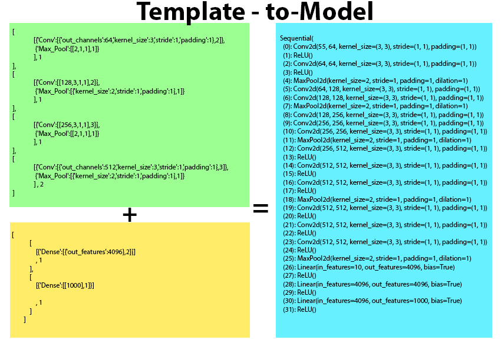
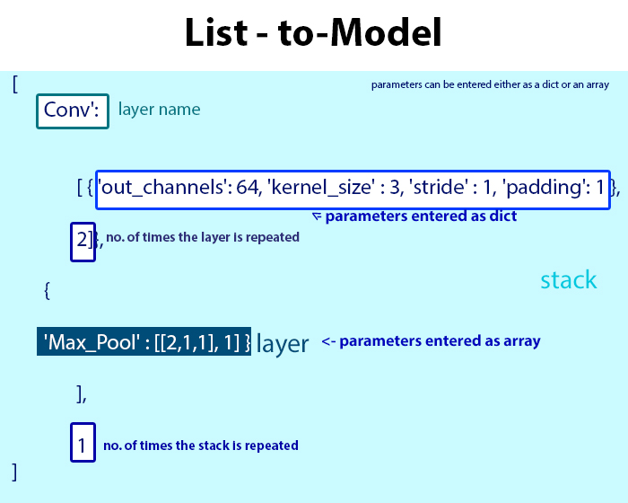

# List to CNN Layers
The library takes a list of layer/ block (referred here as 'stack') parameters and number of times the layer / stack is to be repeated and returns a list of layers that can be directly passed to an nn.Sequential() constructor
## High level summary

    

While trying to replicate large 2D convolutional networks, I realized it was getting a little tiresome, re-creating, copying-pasting a stack of layers again and again. 
So this is an attempt to create a template that allows you to just enter the parameters and the hyperparameters as a list or a dictionary object and it returns a list which:
1. Automatically adds ReLU layers to Conv and Dense Layers 
2. Can be edited to add or remove layers
3. Can be Passed as an nn.Sequential() argument for model creation

We can use the template to configure how many times you want a single layer to be repeated or how many times a set of layers (stack) needs to be repeated

Currently written for torch. TF version coming soon !

## Usage:

    

